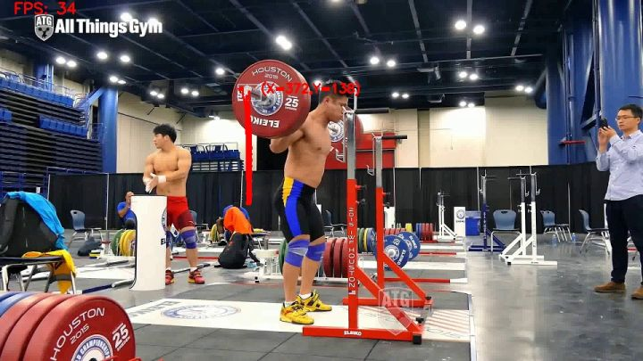

# BarPath_Tracking
    

>*Take my favourite weightlifter Lu XiaoJun as an example*     
## Description  
        
There are 9 different trackers you can choose to track the barbell path,including BOOSTING,MIL,KCF,TLD, MEDIANFLOW, GOTURN, Dlib_Tracker, CamShift and Template_Matching.Not only the barbell path,you can also use these trackers to track other object,like a car or anything else.Some of the comparison results are as follows.      

关于这个简单的追踪器的中文说明在这里：[(｡･ω･｡) 点我点我](http://marticles.github.io/2018/05/05/基于OpenCV与Dlib的杠铃轨迹追踪器/)  

      
      
      
      

## Requirements   
     
* OpenCV3
* Dlib
* Numpy
    
## Start Tracking    
Firstly You need to create a bounding box around the bar(or the obeject) to be tracked.Click the left mouse button to select the bounding box.Then press <kbd>Enter</kbd> to start the tracking.If you want to close the video,just press <kbd>Esc</kbd>.I hope this simple program can help you to lift more weight.    

